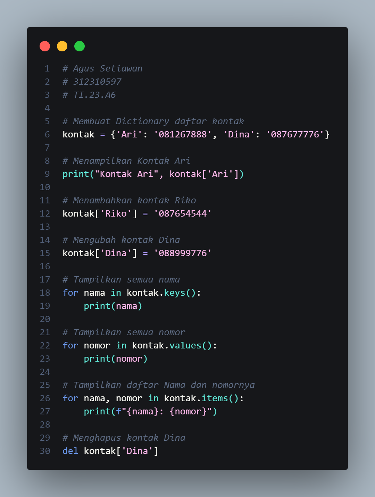
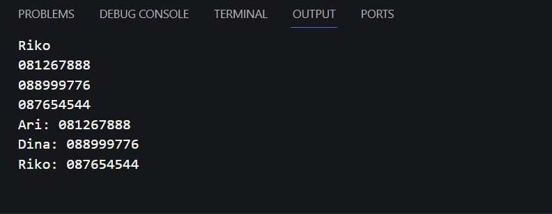
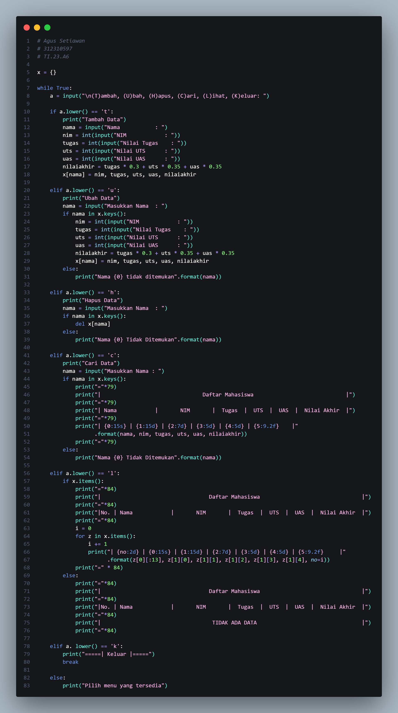
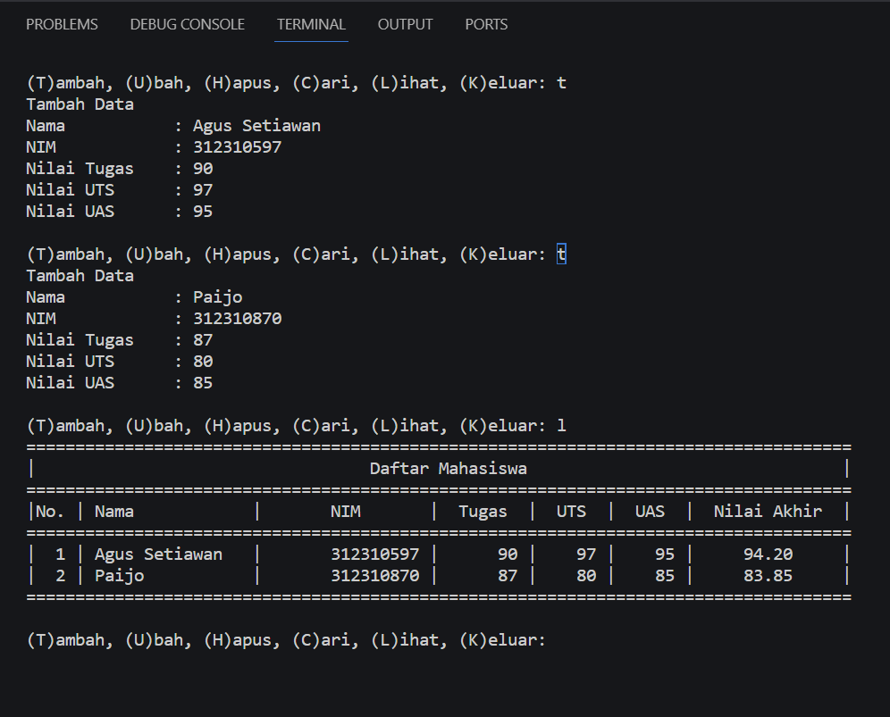
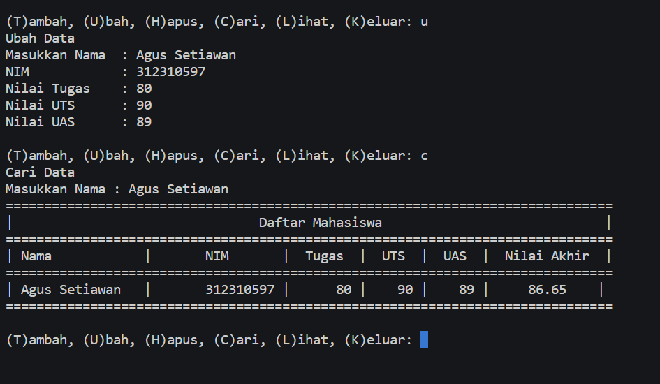
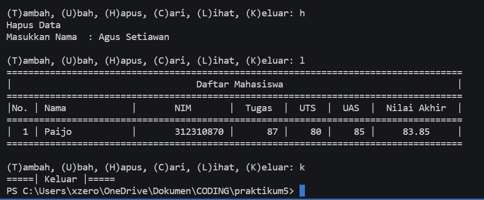

# Praktikum 5
<h1>Latihan</h1>

<h2>Langkah-langkah</h2>
  
<h4>Membuat Dictionary daftar kontak</h4>

```python
kontak = {'Ari': '081267888', 'Dina': '087677776'}
```

<h4>Menampilkan Kontak Ari</h4>

```python
print("Kontak Ari", kontak['Ari'])
```

<h4>Menambahkan kontak Riko</h4>

```python
kontak['Riko'] = '087654544'
```

<h4>Mengubah kontak Dina</h4>

```python
kontak['Dina'] = '088999776'
```

<h4>Tampilkan semua nama</h4>

```python print("=====Menampilkan semua nama=====")
for nama in kontak.keys():
    print(nama)
```

<h4>Tampilkan semua nomor</h4>

```python print("\n=====Menampilkan semua nomor=====")
for nomor in kontak.values():
    print(nomor)
```

<h4>Tampilkan daftar Nama dan nomornya</h4>

```python print("\n=====Menampilkan nama dan nomor=====")
for nama, nomor in kontak.items():
    print(f"{nama}: {nomor}")
```

<h4>Menghapus kontak Dina</h4>

```python 
del kontak['Dina']
```





<h2>Output</h2>




<h1>Praktik</h1>

<h2>Program Data Mahasiswa</h2>



<h2>Langkah-langkah</h2>

<h4>Membuat dictionary kosong</h4>
  
```python
x = {}
```
<h4>Membuat kondisi perulangan dan keterangan untuk pilihan menu</h4>

```python
while True:
    a = input("\n(T)ambah, (U)bah, (H)apus, (C)ari, (L)ihat, (K)eluar: ")
```
<h4>Menambahkan data</h4>

```python
if a.lower() == 't':
        print("Tambah Data")
        nama = input("Nama           : ")
        nim = int(input("NIM            : "))
        tugas = int(input("Nilai Tugas    : "))
        uts = int(input("Nilai UTS      : ")) 
        uas = int(input("Nilai UAS      : "))
        nilaiakhir = tugas * 0.3 + uts * 0.35 + uas * 0.35
        x[nama] = nim, tugas, uts, uas, nilaiakhir
```
<p>Apabila kita mengitputkan 't' maka kita akan diminta untuk mengitputkan data, seperti nama, nim, uts, dan uas. Data tersebut akan masuk ke dalam dictionary 'x' yang telah dibuat dengan data 'nama' sebagai keys dan sisanya sebagai values.</p>

<h4>Mengubah data</h4>

```python
elif a.lower() == 'u':
        print("Ubah Data")
        nama = input("Masukkan Nama  : ")
        if nama in x.keys():
            nim = int(input("NIM            : "))
            tugas = int(input("Nilai Tugas    : "))
            uts = int(input("Nilai UTS      : "))
            uas = int(input("Nilai UAS      : "))
            nilaiakhir = tugas * 0.3 + uts * 0.35 + uas * 0.35
            x[nama] = nim, tugas, uts, uas, nilaiakhir
        else:
            print("Nama {0} tidak ditemukan".format(nama))
```
<p>Jika menginputkan 'u' makan akan ada keterangan untuk mengubah data dan kita akan diminta untuk menginputkan nama yang ingin diubah datanya, apabila nama tidak ada maka outputnya "Nama {} tidak ditemukan". {} adalah nama atau data yang mau diubah.</p>

<h4>Menghapus data</h4>

```python
elif a.lower() == 'h':
        print("Hapus Data")
        nama = input("Masukkan Nama  : ")
        if nama in x.keys():
            del x[nama]
        else:
            print("Nama {0} Tidak Ditemukan".format(nama))
```
<p>Jika menginputkan 'h' maka akan diminta menginputkan nama yang ingin dihapus datanya. Jika nama ada dalam dictionary, maka sistem akan menghapus nama dan datanya.</p>

<h4>Mencari data</h4>

```python
 elif a.lower() == 'c':
        print("Cari Data")
        nama = input("Masukkan Nama : ")
        if nama in x.keys():
            print("="*79)
            print("|                                Daftar Mahasiswa                             |")
            print("="*79)
            print("| Nama            |       NIM       |  Tugas  |  UTS  |  UAS  |  Nilai Akhir  |")
            print("="*79)
            print("| {0:15s} | {1:15d} | {2:7d} | {3:5d} | {4:5d} | {5:9.2f}    |"
                  .format(nama, nim, tugas, uts, uas, nilaiakhir))
            print("="*79)
        else:
            print("Nama {0} Tidak Ditemukan".format(nama))
```
<p>Jika menginput 'c' makan akan diminta untuk memasukkan nama yang ingin dicari. Apabila nama yang dicari ada dalam dictionary maka outputnya akan menampilkan data dari nama tersebut.</p>

<h4>Menampilkan data</h4>

```python
elif a.lower() == 'l':
        if x.items():
            print("="*84)
            print("|                                  Daftar Mahasiswa                                |")
            print("="*84)
            print("|No. | Nama            |       NIM       |  Tugas  |  UTS  |  UAS  |  Nilai Akhir  |")
            print("="*84)
            i = 0
            for z in x.items():
                i += 1
                print("| {no:2d} | {0:15s} | {1:15d} | {2:7d} | {3:5d} | {4:5d} | {5:9.2f}     |"
                      .format(z[0][:13], z[1][0], z[1][1], z[1][2], z[1][3], z[1][4], no=i))
            print("=" * 84)
        else:
            print("="*84)
            print("|                                  Daftar Mahasiswa                                |")
            print("="*84)
            print("|No. | Nama            |       NIM       |  Tugas  |  UTS  |  UAS  |  Nilai Akhir  |")
            print("="*84)
            print("|                                   TIDAK ADA DATA                                 |")
            print("="*84)
```
<p>Jika menginput 'l' maka akan menampilkan data yang sudah kita masukkan sebelumnya. Jika belum memasukkan data maka outputnya menjadi "TIDAK ADA DATA"</p>

<h4>Menghentikan perulangan</h4>

```python
 elif a. lower() == 'k':
        print("=====| Keluar |=====")
        break
```
<p>Apabila menginput 'k' maka program langsung berhenti</p>

<h2>Output</h2>

<h3>Menambahkan Data</h3>



<h3>Mengubah Data</h3>



<h3>Menghapus Data</h3>



<h1>Flowchart</h1>


